# Introduction
- 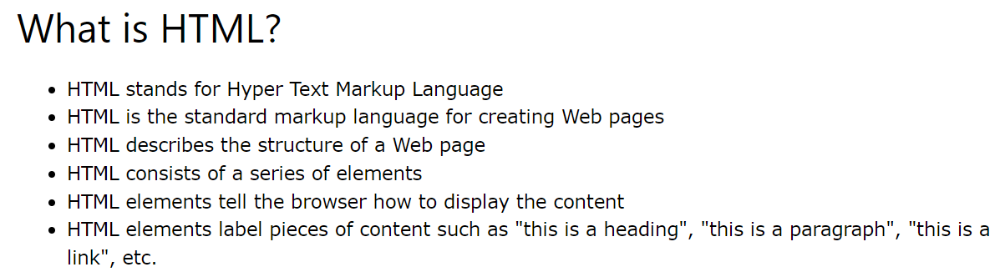
- examples 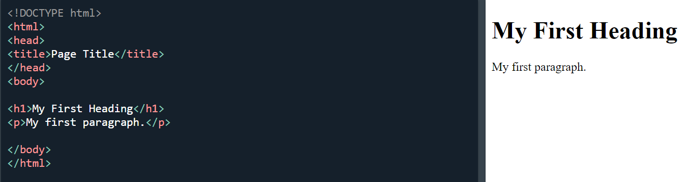
- explanation 
- 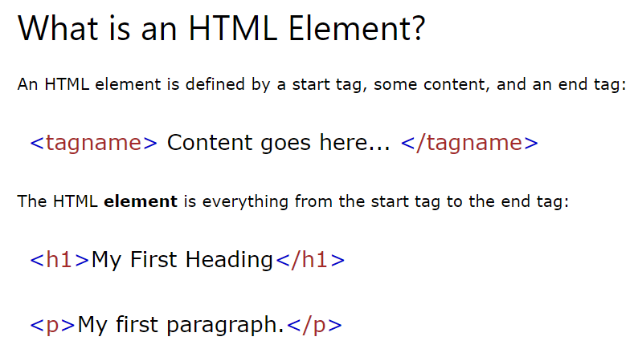
- 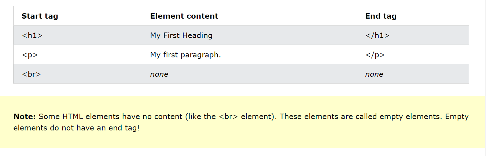
- 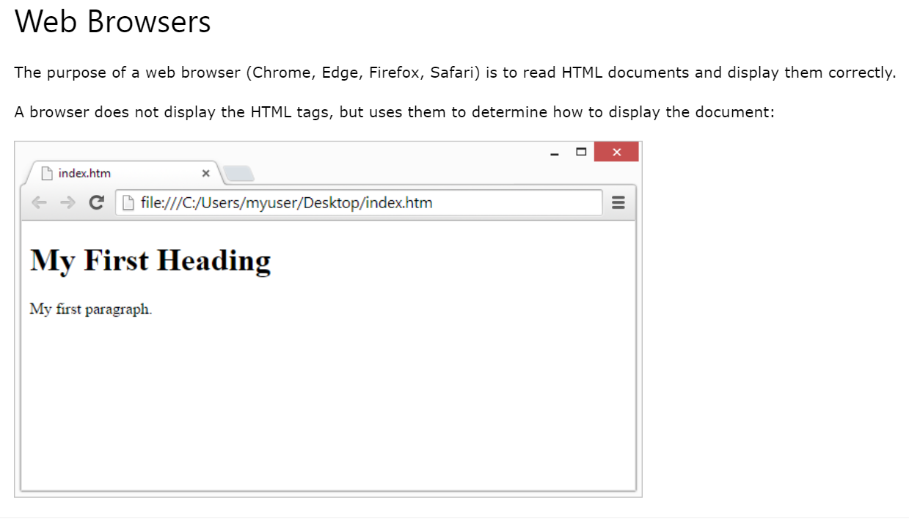
- 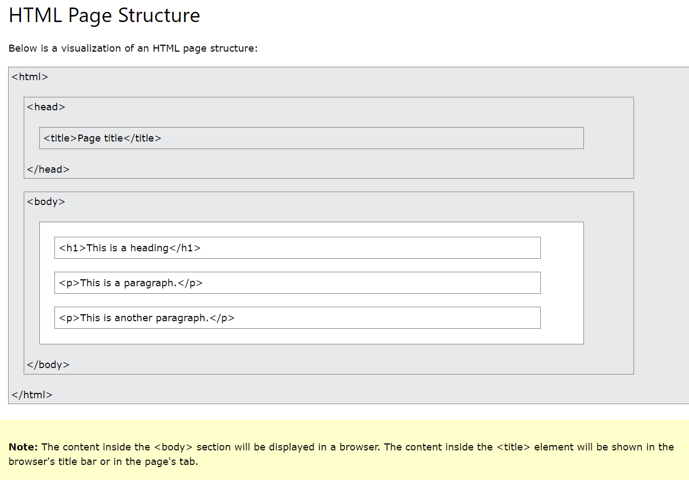
# Basics
- 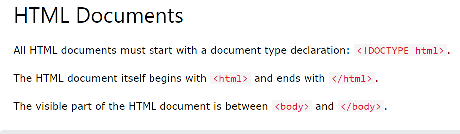
- 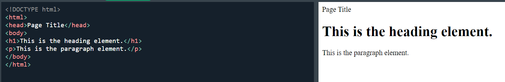
- 
- 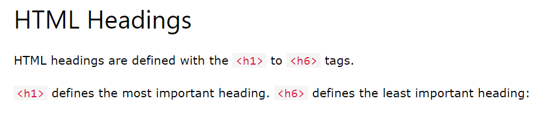
- 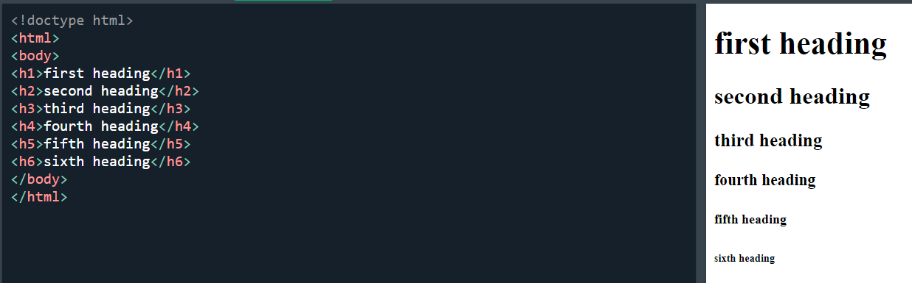
- 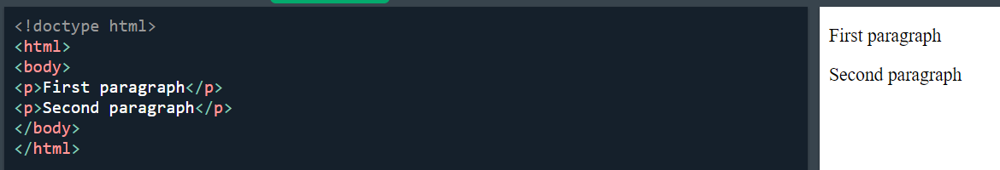
- 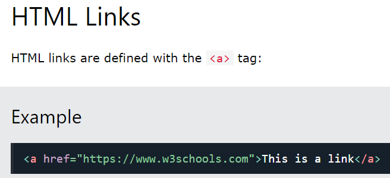
- 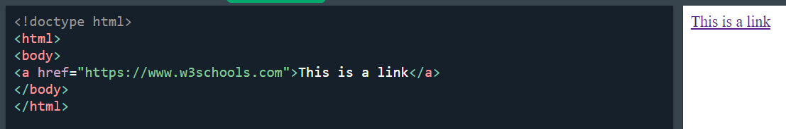
- 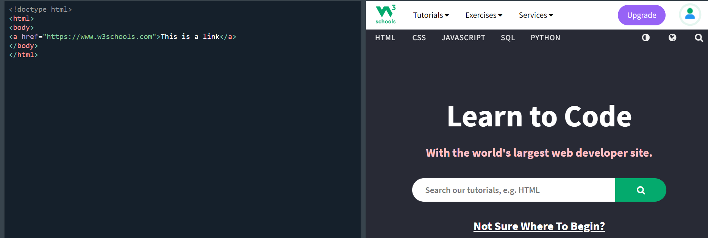
- 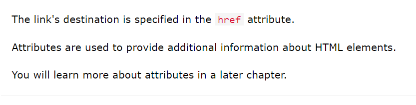
- 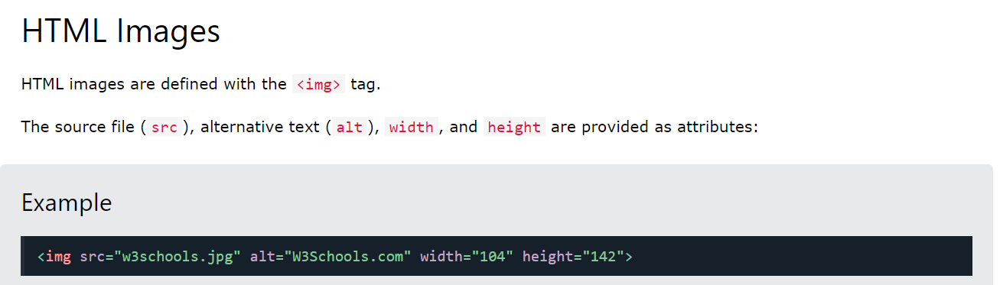
- 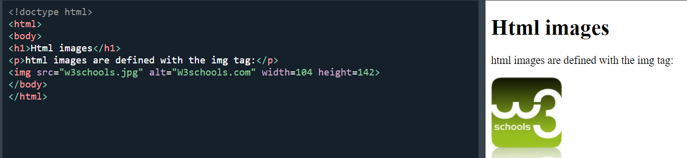
- 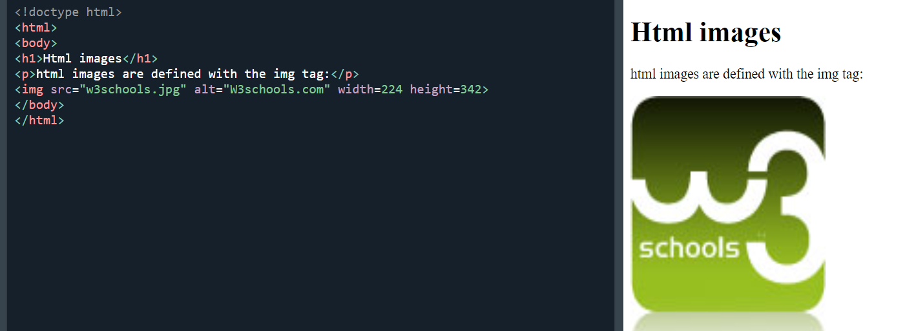
## nested html elements
- 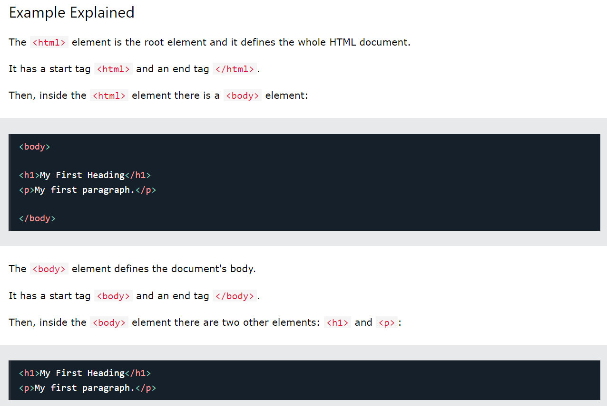
- 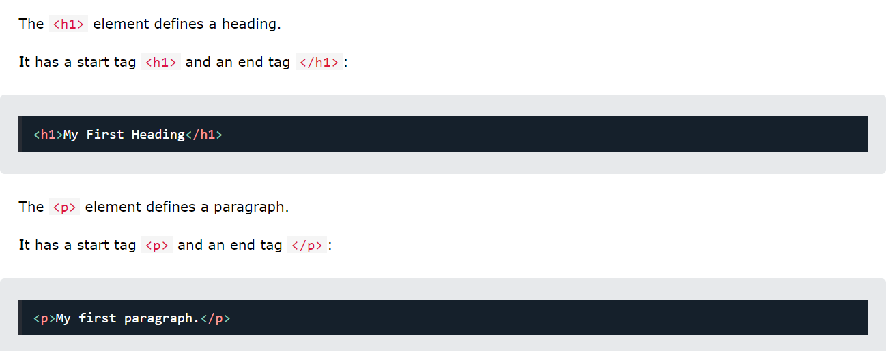
# empty elements
- 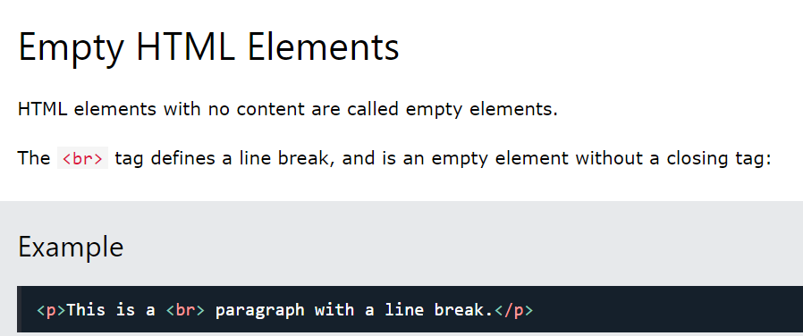
- 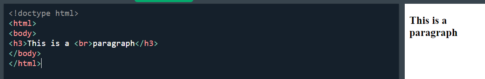
# not case sensitive
- 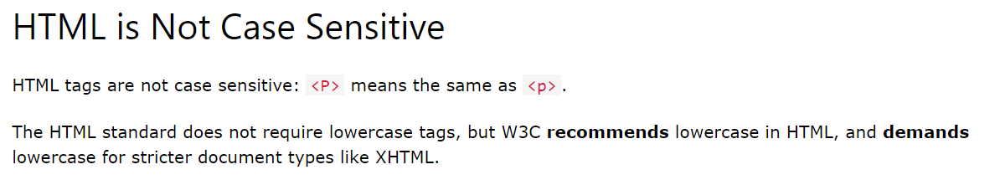
# note
- 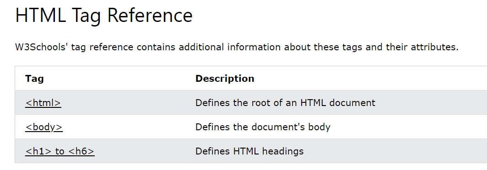
```
https://www.w3schools.com/tags/default.asp
```