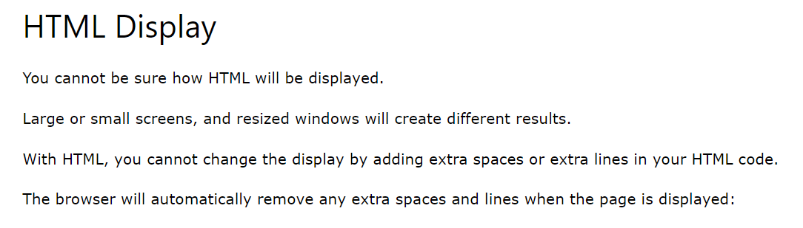

# HTML headings
- 
- 
- 
- 
- 

# HTML paragraphs
- 
- 
- NOTE 
- 
- 
-  
hr tag stands for horizontal rule which provides a horizontal line
- 
- 
- 
- 
- 
- 
# HTML styles
- 
- 
- 
# HTML background color 
- 
- 
# Text Color
- 
- 
# Font family
- 
- 
- 
- 
- 
# Text align
- 
- 
- 